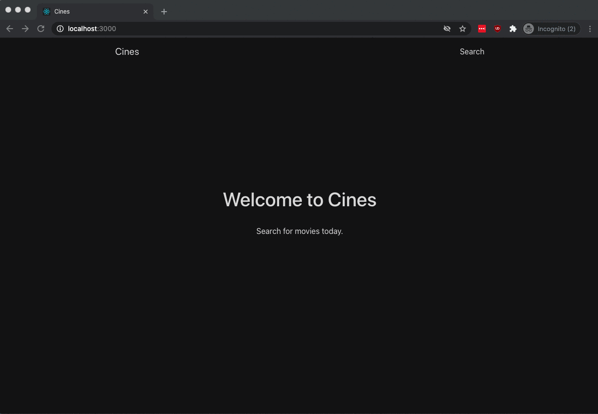

# Cines

Cines is my submission for YearOne's API Design coding challenge. 

Cines is a movie searching app that users can use to search for and vote on movies. Cines is built with React and Express. Movie voting data is stored on a PostgreSQL database. 

I used [OMDb API](http://www.omdbapi.com/) to obtain movie data. The design and aesthetic of Cines was inspired by [a design on Behance](https://www.behance.net/gallery/102849659/Movies-App-Concept).

## Table of Contents

